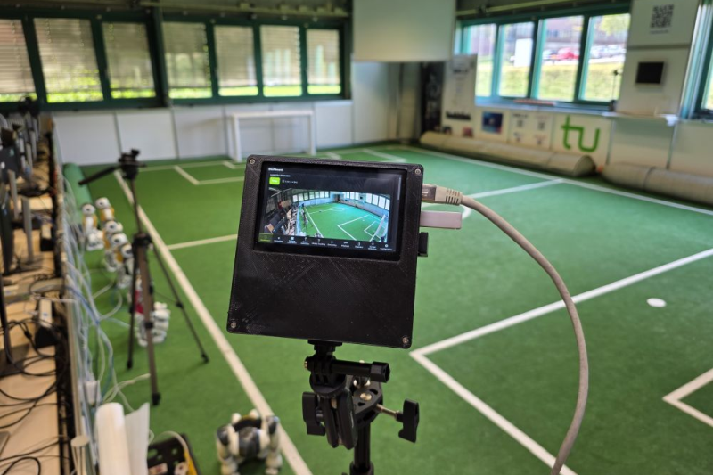

# RoboCup AI Camera - Demonstration Software Stack



This repository contains the **demo build** of the RoboCup AI Camera software stack. It is designed to showcase the capabilities of the AI camera hardware project in a self-contained and easy-to-run setup.

* 🔗 Hardware project: https://klute.com/research/AICamera/
* 🔗 Hardware assembly manual: https://klute.com/research/AICamera/assembly/
* 🔗 Demo version manual: https://klute.com/research/AICamera/assembly/manual/
* 🔗 Demo repository: https://github.com/RuhrbotDevils/aicam-demo
* 🔗 Full software stack: https://github.com/RuhrbotDevils/aicam

---

## Overview

This demo allows you to run the AI camera system on a **real Raspberry Pi device**, including:

* Web-based user interface (dashboard + controls)
* Video & audio recording (H.264 / MP4)
* Real-time object detection (Hailo + CPU fallback)
* Live RTMP streaming
* Playback of recorded sessions

---

## Prerequisites

Before you begin, ensure you have:

* Raspberry Pi 5 
* Raspberry Pi OS (64-bit)
* Raspberry Pi HQ Camera Module (CSI interface)
* Hailo 10H AI Hat+ 2 accelerator
* (Optional) Touchscreen (CSI interface)
* Internet connection during installation

Assembly manual: https://klute.com/research/AICamera/assembly/

---

## System Architecture

The demo consists of several cooperating components:

* **Rust Media Service** (`apps/media_service/`)
  Handles video capture, recording, streaming, overlays, and in-pipeline AI inference.

* **Python Control API** (`apps/control_api/`)
  Provides configuration, orchestration, and system control via REST and WebSocket.

* **CPU AI Worker** (`apps/ai_worker/cpu_detector.py`)
  Runs YOLO object detection on CPU (Ultralytics/PyTorch) and publishes results as a fallback when no Hailo accelerator is present.

* **Model Registry** (`apps/model_registry.py`)
  Loads AI models from configuration files.

* **Browser UI** (`apps/ui/`)
  Includes:

  * Dashboard
  * Recording
  * Object Detection
  * Streaming
  * Playback
  * Configuration

* **ZeroMQ Bus** (`apps/bus/`)
  Enables inter-process communication between all services.

---

## Quick Start

### 1. Clone the repository

On your Raspberry Pi (locally or via SSH):

```bash
git clone https://github.com/RuhrbotDevils/aicam-demo.git
cd aicam-demo
```

---

### 2. Run the install script

```bash
./scripts/install_locally.sh --install-rust
```

⏱️ **Estimated time:** 10-30 minutes depending on system performance.

This script will:

* Install required system packages
* Create a Python virtual environment
* Build the Rust media service
* Build and install the NV12 broadcast-overlay GStreamer plugin
* Build Hailo post-processing libraries
* Set up configuration and model files
* Install and enable systemd services
* Set up the inbound firewall (and the sudoers rule the UI uses to re-apply it)
* Configure kiosk autostart, a desktop shortcut to relaunch the UI, and the desktop wallpaper
* Apply Pi kernel/firmware tuning (USB current for the Hailo accelerator, swappiness)

If Rust is already installed, you may omit `--install-rust`.

---

### 3. Start the system

```bash
./scripts/start_all.sh
```

Then open a browser and navigate to:

```
http://<camera-ip>:8000
```

To find your device IP:

```bash
hostname -I
```

---

### 4. Reboot (recommended)

```bash
sudo reboot
```

After reboot:

* All services start automatically
* The touchscreen (if available) runs the UI in kiosk mode
* The UI is accessible via browser

---

## Usage

Once running, the web interface provides access to:

* Camera feed/preview
* Object detection visualization
* Recording
* Streaming
* Playback of recorded sessions
* System configuration

Manual of the demo release:
`https://klute.com/research/AICamera/assembly/manual/`

---

## Management Scripts

Located in `scripts/`:

* `install_locally.sh` - Install and build system
* `run_kiosk.sh` - start the local browser in kiosk mode
* `start_all.sh` - Start all services
* `stop_all.sh` - Stop all services
* `status_all.sh` - Show service status

---

## Troubleshooting

### Check service status

```bash
./scripts/status_all.sh
```

### View logs

```bash
journalctl -u aicam-* -f
```

### Common issues

* **Web UI not reachable**

  * Check IP address
  * Ensure port 8000 is not blocked

* **Camera not detected**

  * Verify camera is present 
  * Check cable connection

* **Installation failed**

  * Re-run install script
  * Check internet connection

---

## AI Development Disclosure

This software has been developed using an AI-assisted software development lifecycle (SDLC) framework at ingenit (https://www.ingenit.com/), where human software developers and AI assistant systems collaborate throughout the development process.
All system components were designed, reviewed, and validated by human developers.

---

## License

This software is licensed under the GPL-3.0 license

---
